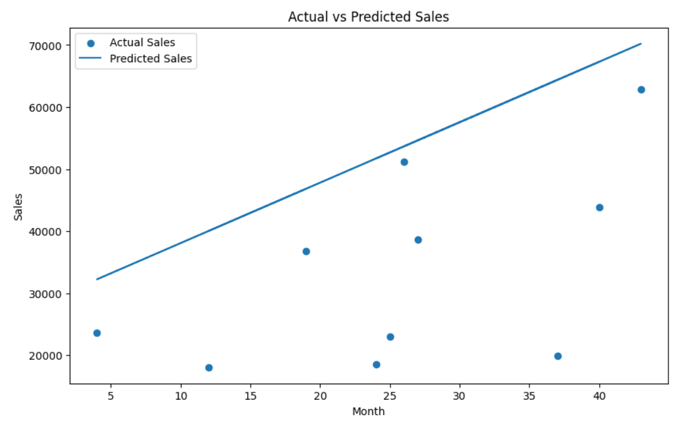
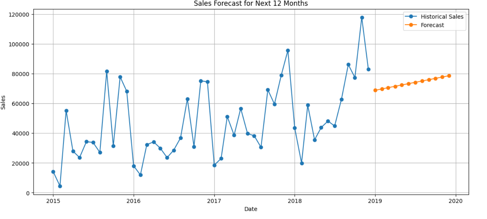

# 📈 Predictive Analytics Using Historical Data

## 📌 Overview

This project demonstrates predictive analytics using historical sales data. A Linear Regression model was built in Google Colab to forecast future sales trends, and the results were visualized through an interactive Power BI dashboard.

## 🎯 Objectives

- Clean and preprocess historical data
- Build a Linear Regression model
- Forecast future sales
- Evaluate model performance
- Create an interactive Power BI dashboard

---

## 🛠️ Tech Stack

- Python
- Google Colab
- Pandas
- NumPy
- Matplotlib
- Scikit-learn
- Power BI
- Git & GitHub

---

## 📊 Dashboard Features

- Total Historical Sales KPI
- Average Sales KPI
- Forecast Sales KPI
- Historical Sales Trend
- Monthly Sales Analysis
- Actual vs Predicted Sales
- Future Sales Forecast
- Monthly Forecast Sales
- Interactive Date Filter

---

## 📂 Project Structure

```text
Predictive-Analytics-Using-Historical-Data/
│
├── Dashboard/
├── Dataset/
├── Notebook/
├── Images/
├── README.md
├── requirements.txt
└── .gitignore
```

---

## 📸 Dashboard Preview

### Main Dashboard


### Actual vs Predicted Sales



### Future Sales Forecast



---

## 🚀 How to Run

1. Clone the repository.
2. Install the required libraries.
3. Open the notebook in Google Colab or Jupyter Notebook.
4. Run all cells.
5. Open the Power BI dashboard (`.pbix`).

---

## 📈 Model Evaluation

- Mean Absolute Error (MAE)
- Root Mean Squared Error (RMSE)
- R² Score

---

## 👩‍💻 Author

**Pathan Laharin**

Computer Science & Engineering Student | Aspiring Data Analyst
